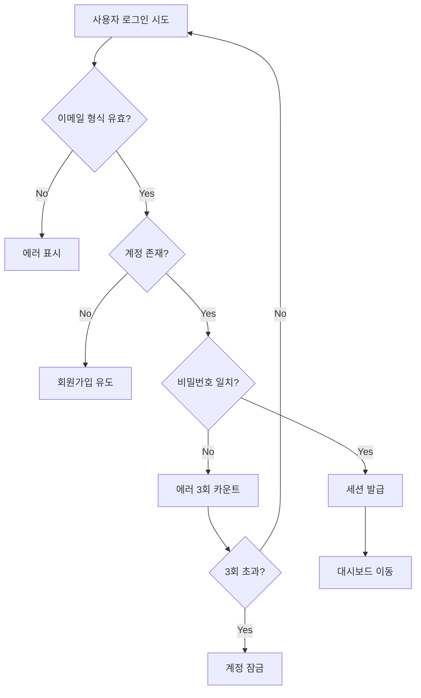
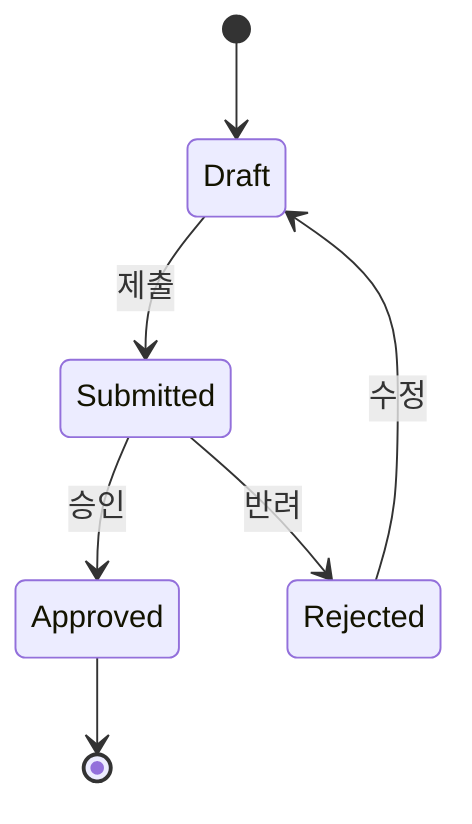
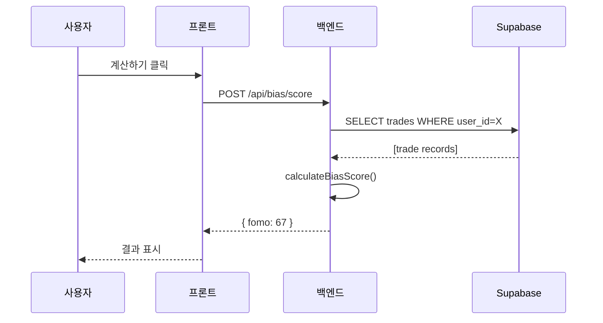

# flowchart

**버전**: v6.0
**주 사용 에이전트**: designer, planner
**연계 스킬**: wireframe-spec, requirements-spec

---

## 목적

사용자 플로우·비즈니스 로직·의사결정 트리를 Mermaid 다이어그램으로 표현.
복잡한 분기·조건을 말로 설명하는 대신 시각화.

---

## 호출 시점

- 복잡한 사용자 플로우 (온보딩·결제·다단계 폼)
- 비즈니스 로직에 분기 다수
- 권한·상태에 따른 동작 차이
- 에러 복구 플로우
- 백엔드 파이프라인 (자동화·배치 작업)

---

## 입력

- 요건서 또는 구현 코드
- 플로우 범위 (전체 vs 특정 시나리오)

---

## 절차

### 1. 시작·종료 지점 정의
- 시작: 사용자·시스템이 이 플로우에 진입하는 시점
- 종료: 성공·실패·중단 상태들

### 2. 주요 단계 나열
- 단계 목록 (5~15개 권장, 많으면 분할)
- 각 단계가 "동작"인지 "결정"인지 구분

### 3. 분기 조건 명시
- Yes/No 분기
- 다중 분기 (switch)
- 조건 텍스트 짧게 (`로그인됨?`, `액수 > 100만원?`)

### 4. 상태·데이터 변화 표기
- 중요한 상태 전이는 노드에 명시
- DB 변경·외부 호출도 별도 노드

### 5. Mermaid 작성
- `flowchart TD` (세로 top-down) 또는 `LR` (가로)
- 방향 일관성 유지
- 색은 과용 금지 (분기 강조 1~2색)

### 6. 설명 텍스트 동반
다이어그램만으로 이해 안 되는 부분 요약.

---

## 출력

### 기본 flowchart


### 상태 머신 (statediagram)


### 시퀀스 (sequenceDiagram)


---

## 체크리스트

- [ ] 시작·종료 모두 있음
- [ ] 모든 분기에 양 갈래 (Yes/No) 경로
- [ ] 결정 노드(마름모)와 동작 노드(사각) 구분
- [ ] 조건 텍스트 짧고 명확
- [ ] 5~15 노드 내 (많으면 분할)
- [ ] 에러·예외 경로 포함

---

## 금지

- **과도한 복잡도**: 노드 20개 초과 → 분할 또는 서브 플로우
- **색 남용**: 의미 없는 색 분류
- **코드만**: 다이어그램 없이 Mermaid 코드만 제공 (렌더링 확인 필요)
- **주 경로만**: 에러 경로 생략

---

## 예시 사용

**designer가 요청받음**:
```
허브와이즈 가입~온보딩 플로우 설계. 이메일 인증, 성향 테스트, 편향 분석
초기화까지.
```

**designer 산출**:
flowchart TD로 10~12 노드 구성. 이메일 인증 실패·타임아웃·건너뛰기 경로 포함.
주 성공 경로는 파란색(class 사용), 예외는 회색.
