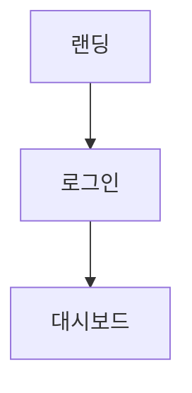

# wireframe-spec

**버전**: v6.0
**주 사용 에이전트**: designer
**연계 스킬**: wireframe, ui-component

---

## 목적

한국 서비스 기획자 관행에 맞는 **화면설계서(화면기획서)** 양식. 와이어프레임에
상세 기능 명세를 붙인 형식. designer 산출물 중 프로젝트에서 공식 전달용으로
쓰는 포맷.

---

## 호출 시점

- 공식 화면설계서 필요 시 (회사 업무, 경진대회 제출물)
- 개인 프로젝트에서 와이어프레임 + 명세 함께 필요할 때
- Figma 기반 화면설계서 작성 전 구조 확정

---

## 입력

- 요건서
- 대상 화면 목록
- 스타일 선택:
  - **PPT 스타일**: 슬라이드 단위, 회사 공식 양식
  - **페이지 스타일**: 캔버스 단위, 자유 흐름

---

## 절차

### 1. 스타일 선택 (CEO 확인)
- 회사 업무·경진대회 제출: PPT 스타일
- 개인 프로젝트 (허브와이즈·B무거나): 페이지 스타일 또는 HTML 아티팩트

### 2. 화면 목록 작성
- 대상 화면 번호 부여: SCRN-001, SCRN-002...
- 플로우 순서대로 정렬

### 3. 각 화면 명세 작성
각 화면마다:
- 화면 ID·명
- 화면 개요 (이 화면의 목적)
- 와이어프레임
- 항목별 기능 명세 표
- 이동 경로 (다음 화면)
- 예외 처리

### 4. 플로우 다이어그램 추가
`flowchart` 스킬 활용. 화면 간 이동 경로·조건.

### 5. 공통 규칙 섹션
- 용어 정의
- 에러 처리 공통 원칙
- 응답 시간 기준

---

## 출력

```markdown
# <서비스명> 화면설계서

**버전**: 1.0
**작성일**: YYYY-MM-DD
**작성자**: designer
**스타일**: PPT | 페이지

---

## 1. 문서 개요
- 프로젝트:
- 범위:
- 독자:

## 2. 공통 규칙
### 용어 정의
| 용어 | 정의 |

### 에러 처리 공통
- 네트워크 실패:
- 세션 만료:
- 서버 에러:

### 성능 기준
- 페이지 로드: 3초 이내
- API 응답: 1초 이내 (p95)

## 3. 플로우 다이어그램


## 4. 화면 상세

### SCRN-001 랜딩 페이지
**개요**: 미로그인 사용자 첫 진입점

**와이어프레임**:
```
<ASCII 또는 이미지 참조>
```

**항목별 기능**:
| # | 영역 | 요소 | 기능 | 비고 |
|---|---|---|---|---|
| 1 | 헤더 | 로고 | 클릭 시 랜딩 복귀 | 고정 |
| 2 | 헤더 | 로그인 버튼 | SCRN-002 이동 | |
| 3 | 히어로 | 메인 헤드라인 | 정적 | copywriter |
| 4 | 히어로 | CTA 버튼 | 로그인 상태별 분기 | |
| 5 | 피처 섹션 | 카드 4개 | 각각 설명 | |

**이동 경로**:
- 로그인 버튼 → SCRN-002
- 회원가입 버튼 → SCRN-003
- 각 피처 카드 → 해당 기능 상세 (없으면 앵커 스크롤)

**예외 처리**:
- 로그인 상태인 경우 CTA 변경 ("대시보드로")
- 모바일: 햄버거 메뉴 노출

---

### SCRN-002 로그인
... (동일 구조)

---

## 5. 변경 이력
| 버전 | 날짜 | 변경 |
```

---

## 체크리스트

- [ ] 모든 화면에 ID 부여
- [ ] 각 화면의 항목별 기능표 작성
- [ ] 이동 경로 명시
- [ ] 예외 처리 (로그인 여부·모바일 등)
- [ ] 공통 규칙 섹션
- [ ] 플로우 다이어그램
- [ ] 용어 정의

---

## 금지

- **상세 디자인 픽셀**: 화면설계서는 구조, 디자인은 Figma
- **구현 기술 명시**: "useState 훅 사용" 같은 거 금지
- **일부 화면 누락**: 플로우상 존재하는 모든 화면 포함
- **항목번호 누락**: 와이어프레임의 각 영역이 기능표와 매칭되어야 함
